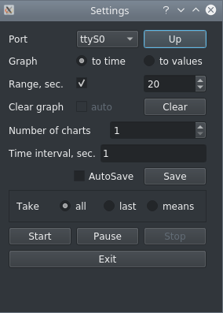

# Recorder_for_MCU
Recorder for MCU – программа для мониторинга данных с последовательного порта в реальном времени. Программа написана на C++ с использованием библиотеки Qt.


## Зависимость
Qt >= 5.7

## Скачать скомпилируюмую версию для Windows
https://github.com/new99/Recorder_for_MCU/releases

## Как использовать
Программа работает с данными считывающие с последовательного порта. Полученные данные имеют тип `String` и имеют вид:
`"f1/r/nf2/r/n … fn/r/n/r/n"`,
где ее можно разделить на три части:
* `"f1/r/n"`, `"f2/r/n"` и `"f3/r/n"` — данные передаваемые с микроконтроллера;
* `"/r/n"`  - разделение данных;
* `"" + "/r/n"` — сигнализирует об окончании считывания данных (в конце имеем вид `"fn/r/n/r/n"`), для работы со следующей строкой.

## Настройки



* `Port` отвечает за подключение последовательного порта имеет список устройств подключенных через последовательный порт, кнопка `Up` обновляет список;
* `Graph` для мониторинга данных имеет два параметра `to_time` - мониториг данных во времени и `to_values` - мониторинг зависимости `f(x)`;
* `Range` если галочка установлена, то оси абцисс задается фиксированый диапазон;
* `Clear graph` если установлена галочка то происходит автоматическое обновление графика, когда значение по оси абцисс, кнопка `Clear` обновляет график немедлено;
* `Number of charts` количество графиков;
* `time interval` временной интервал, отвечающий за обновления данных;
* `Take` отвечает каким образом регистрировать значения в заданный `time interval`;
* Кнопка `Save` сохраняет данные в файле;
* `AutoSave` если галочка установлена, то сразу записывает данные в файле;

## Примеры
В качестве примера представлена работа Recorder_for_MCU с Arduino.
`Serial.println(f1)` - стандартная функция для вывода в Arduino впредставляться будет в виде `"f1/r/n"`
`Serial.println()` - пустая строка в виде `"" + "/r/n"` сигнализирует об окончании считывания данных.

### Мониторинг значений во времени (to_time)
Исходный код Arduino
```c
double x = 0;
void setup()
{
  Serial.begin(9600);
}

void loop() {
  double f1 = sin(x);
  double f2 = sin(2 * x);
  double f3 = 2 * f1 + f2;
  x += 0.003;
  Serial.println(f1, 5);
  Serial.println(f2, 5);
  Serial.println(f3, 5);
  Serial.println();
}
```


### Мониторинг зависимости (to_values)
Исходный код Arduino
```c
double x = 0;
int a = 1;
void setup()
{
  Serial.begin(9600);
}

void loop()
{
  double f1 = exp(x)-1;
  if(x < -10)
    a = 1;
  if(x > 10)
    a = -1;

  x += a * 0.001;
  Serial.println(x, 5);
  Serial.println(f1, 5);
  Serial.println();
}
```


